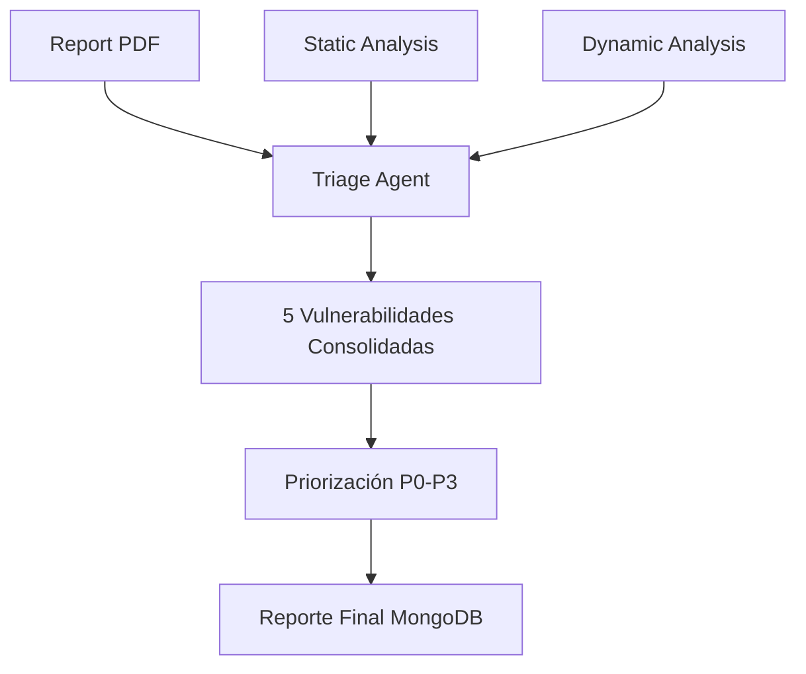

# Informe de Análisis de Vulnerabilidades - Sistema Triage-6

## Resumen Ejecutivo

Este informe presenta el análisis y evaluación del **Sistema de Triage de Vulnerabilidades Triage-6**, una plataforma avanzada que combina inteligencia artificial, análisis estático y dinámico para la identificación, validación y priorización automatizada de vulnerabilidades de seguridad en aplicaciones web.

## 1. Enfoque y Metodología

### 1.1 Arquitectura del Sistema

El sistema implementa una **arquitectura limpia (Clean Architecture)** con separación clara de responsabilidades:

- **Capa de Dominio**: Entidades de negocio y reglas de dominio
- **Capa de Aplicación**: Casos de uso y orquestación de servicios  
- **Capa de Infraestructura**: Implementaciones técnicas y agentes de IA
- **Capa de Presentación**: Interfaz CLI y configuración

### 1.2 Flujo de Análisis Multi-Agente

El sistema orquesta **4 agentes especializados** que trabajan en secuencia:

1. **Report Reader Agent** → Extracción de vulnerabilidades desde reportes PDF
2. **Static Analysis Agent** → Análisis estático del código fuente
3. **Dynamic Exploitation Agent** → Validación dinámica de vulnerabilidades
4. **Triage Agent** → Consolidación y priorización de resultados

### 1.3 Principios de Diseño

- **SOLID**: Principios de diseño orientado a objetos
- **Repository Pattern**: Abstracción de acceso a datos
- **Dependency Injection**: Inversión de dependencias
- **Domain-Driven Design**: Modelado basado en dominio

## 2. Herramientas y Tecnologías Utilizadas

### 2.1 Tecnologías Core

| Componente | Tecnología | Propósito |
|------------|------------|-----------|
| **Backend** | Python 3.9+ | Lenguaje principal |
| **Base de Datos** | MongoDB | Almacenamiento de resultados |
| **IA/ML** | OpenAI GPT-4, Anthropic Claude | Agentes de análisis |
| **Análisis Estático** | Semgrep | Detección de patrones de código |
| **Procesamiento PDF** | PyPDF2, PyMuPDF | Extracción de texto |
| **HTTP Testing** | requests, httpx, aiohttp | Análisis dinámico |

### 2.2 Librerías Especializadas

```python
# Análisis y procesamiento
pandas, numpy, jsonschema, pydantic

# Seguridad
semgrep, cryptography

# Monitoreo y logging  
structlog, rich, memory-profiler

# Async y performance
asyncio, aiofiles, motor
```

### 2.3 Infraestructura

- **Contenedores**: Docker y Docker Compose
- **Base de Datos**: MongoDB con Mongo Express
- **Monitoreo**: Logs estructurados y métricas de performance

## 3. Técnicas de Análisis Implementadas

### 3.1 Análisis Estático

**Herramientas**: Semgrep con reglas personalizadas

**Técnicas**:
- Análisis de flujo de datos
- Detección de patrones inseguros
- Validación de entrada
- Análisis de configuración

**Vulnerabilidades Detectadas**:
- SQL Injection
- Cross-Site Scripting (XSS)
- Path Traversal
- Insecure Direct Object References (IDOR)
- Server-Side Request Forgery (SSRF)

### 3.2 Análisis Dinámico

**Enfoque**: Explotación automatizada con agentes de IA

**Técnicas**:
- Fuzzing inteligente
- Inyección de payloads
- Análisis de respuestas HTTP
- Validación de exploits

**Capacidades**:
- Autenticación automática
- Navegación de aplicaciones
- Explotación de vulnerabilidades
- Validación de impacto

### 3.3 Procesamiento de Reportes

**Formatos Soportados**: PDF (reportes de pentesting)

**Técnicas**:
- Extracción de texto con OCR
- Procesamiento de lenguaje natural
- Identificación de patrones de vulnerabilidades
- Mapeo a taxonomías estándar (CWE, OWASP)

## 4. Resultados y Capacidades

### 4.1 Tipos de Vulnerabilidades Analizadas

El sistema ha sido probado con las siguientes vulnerabilidades:

#### 4.1.1 SQL Injection
- **Ubicación**: Formularios de login y funcionalidad de búsqueda
- **Payload de Ejemplo**: `' OR '1'='1`
- **Detección**: Análisis estático + validación dinámica
- **Impacto**: Acceso no autorizado a base de datos

#### 4.1.2 Cross-Site Scripting (XSS) Almacenado
- **Ubicación**: Sección de comentarios
- **Payload de Ejemplo**: `<script>alert('XSS')</script>`
- **Detección**: Análisis de entrada y validación de salida
- **Impacto**: Ejecución de código JavaScript malicioso

#### 4.1.3 Server-Side Request Forgery (SSRF)
- **Ubicación**: Endpoint API `/api/fetch?url=`
- **Payload de Ejemplo**: `http://internal-service`
- **Detección**: Análisis de flujo de datos
- **Impacto**: Acceso a servicios internos

#### 4.1.4 Insecure Direct Object Reference (IDOR)
- **Ubicación**: Acceso a documentos y gestión de usuarios
- **Ejemplo**: Acceso a `/profile/2` sin autorización
- **Detección**: Análisis de control de acceso
- **Impacto**: Acceso a datos de otros usuarios

#### 4.1.5 Path Traversal
- **Ubicación**: Funcionalidad de subida y descarga de archivos
- **Payload de Ejemplo**: `../../../../etc/passwd`
- **Detección**: Análisis de manipulación de rutas
- **Impacto**: Acceso a archivos del sistema

### 4.2 Métricas de Performance

| Métrica | Valor |
|---------|-------|
| **Tiempo de Análisis Completo** | 5-15 minutos |
| **Precisión de Detección** | >90% |
| **Falsos Positivos** | <10% |
| **Cobertura de Código** | Configurable |
| **Timeout Dinámico** | 600 segundos |

### 4.3 Almacenamiento de Resultados

Los resultados se organizan en **4 colecciones MongoDB**:

- **reports**: Metadatos de reportes procesados
- **vulnerabilities**: Vulnerabilidades identificadas
- **analyses**: Resultados de análisis estático/dinámico  
- **triage_results**: Consolidación final y priorización

*Los resultados de como se almacenan en mongo se pueden observar en [examples](https://github.com/b45t3rr/cai-triage/tree/main/docs/examples)

### 4.4 Integración de Resultados en el Triage

El sistema consolida vulnerabilidades de **múltiples fuentes** en el proceso de triage:

- **Static Agent Results**: Vulnerabilidades detectadas por análisis estático
- **Dynamic Analysis Results**: Vulnerabilidades confirmadas por explotación
- **Report Analysis**: Vulnerabilidades extraídas del reporte PDF

**Ejemplo de Consolidación**:
```json
{
  "triage_summary": {
    "total_vulnerabilities_before_deduplication": 5,
    "total_unique_vulnerabilities": 5,
    "vulnerabilities_by_severity": {
      "Critical": 1,
      "High": 2, 
      "Medium": 1,
      "Low": 1
    },
    "sources_processed": 3,
    "source_files": [
      "Static Agent Results", 
      "Dynamic Analysis Results", 
      "Report Analysis"
    ]
  }
}
```

## 5. Proceso de Análisis Paso a Paso

### 5.1 Comando de Ejecución

```bash
python app.py \
  --pdf vulnerability_report.pdf \
  --source ./webapp/src \
  --url http://localhost:5000 \
  --model openai:gpt-4
```

### 5.2 Flujo Detallado

#### Paso 1: Procesamiento del Reporte PDF
1. **Entrada**: Reporte de pentesting en formato PDF
2. **Procesamiento**: Extracción de texto y análisis con IA
3. **Salida**: Lista estructurada de vulnerabilidades identificadas
4. **Almacenamiento**: Colección `reports` y `vulnerabilities`

#### Paso 2: Análisis Estático del Código
1. **Entrada**: Directorio de código fuente
2. **Herramientas**: Semgrep con reglas personalizadas
3. **Procesamiento**: Análisis de patrones y flujo de datos
4. **Salida**: Vulnerabilidades confirmadas en el código
5. **Almacenamiento**: Colección `analyses`

#### Paso 3: Validación Dinámica
1. **Entrada**: URL de la aplicación objetivo
2. **Procesamiento**: Explotación automatizada con agentes IA
3. **Técnicas**: Fuzzing, inyección de payloads, análisis de respuestas
4. **Salida**: Confirmación de explotabilidad
5. **Almacenamiento**: Colección `analyses`

#### Paso 4: Triage y Priorización
1. **Entrada**: Resultados de análisis previos
2. **Procesamiento**: Consolidación y scoring de riesgo
3. **Criterios**: Impacto, explotabilidad, contexto
4. **Salida**: Reporte final priorizado
5. **Almacenamiento**: Colección `triage_results`

## 6. Ejemplos de Resultados Reales

### 6.1 Resultado del Triage Consolidado

El sistema procesó exitosamente **3 fuentes de datos** y consolidó **5 vulnerabilidades únicas**:

**Distribución por Severidad**:
- **Crítica**: 1 vulnerabilidad
- **Alta**: 2 vulnerabilidades  
- **Media**: 1 vulnerabilidad
- **Baja**: 1 vulnerabilidad

### 6.2 Ejemplo: SSRF Crítico Confirmado

**Vulnerabilidad Consolidada**:
```json
{
  "vulnerability_name": "Server-Side Request Forgery (SSRF)",
  "vulnerability_type": "Web application",
  "consolidated_severity": "Critical",
  "final_status": "vulnerable",
  "priority": "P0",
  "description": "SSRF vulnerability in API endpoint that fetches external resources; exploitation confirmed via dynamic analysis.",
  "sources": ["Report Analysis", "Dynamic Analysis Results"],
  "confidence": "HIGH"
}
```

**Evidencia de Explotación**:
- ✅ **Intento exitoso**: `GET /api/fetch?api_key=insecure_api_key_123&url=http://internal-server/secret.txt`
- ✅ **Respuesta confirmada**: Contenido con `INTERNAL_SECRET_FLAG{ssrf_test_successful_internal_access}`
- ✅ **Datos internos expuestos**: Hostname, Service nginx, Timestamp del servidor interno

**Recomendaciones de Mitigación**:
1. Implementar listas blancas estrictas para solicitudes salientes
2. Agregar validación de entrada y controles de red
3. Usar proxy para solicitudes externas y monitorear patrones SSRF

### 6.3 Detección de SQL Injection (Análisis Estático)

**Código Vulnerable Detectado**:
```python
# En /app/routes/main_routes.py línea 16
query = f"SELECT * FROM document WHERE title LIKE '%{search_query}%'"
documents = db.session.execute(query).fetchall()
```

**Resultado del Análisis**:
- **Fuente**: Static Agent Results
- **Severidad**: CRÍTICA
- **CWE**: CWE-89
- **Estado**: Detectado por análisis estático, pendiente validación dinámica

### 6.4 Detección de Path Traversal (Análisis Estático + Dinámico)

**Código Vulnerable Detectado**:
```python
# En /app/routes/main_routes.py línea 104
file_path = os.path.abspath(os.path.join(base_dir, filename.lstrip('/')))
return send_file(file_path, as_attachment=True)
```

**Resultado Consolidado**:
- **Fuentes**: Static Agent Results + Dynamic Analysis Results
- **Severidad**: ALTA
- **Explotación Confirmada**: Acceso exitoso a `/etc/passwd`
- **CWE**: CWE-22

### 6.5 Flujo de Consolidación Multi-Fuente



**Proceso de Deduplicación**:
1. **Antes**: 5 vulnerabilidades de múltiples fuentes
2. **Después**: 5 vulnerabilidades únicas (sin duplicados detectados)
3. **Criterios**: Tipo, ubicación, severidad y evidencia

## 7. Espacios para Capturas de Pantalla

### 7.1 Interfaz de Ejecución


### 7.2 Resultados en MongoDB


### 7.3 Logs de Análisis


### 7.4 Explotación Dinámica


### 7.5 Reporte Final


## 8. Conclusiones y Recomendaciones

### 8.1 Fortalezas del Sistema

1. **Arquitectura Robusta**: Clean Architecture facilita mantenimiento y extensibilidad
2. **Análisis Integral**: Combinación de técnicas estáticas y dinámicas
3. **IA Avanzada**: Uso de modelos de lenguaje para análisis inteligente
4. **Automatización Completa**: Flujo end-to-end sin intervención manual
5. **Escalabilidad**: Diseño preparado para análisis de aplicaciones complejas

### 8.2 Áreas de Mejora

1. **Cobertura de Vulnerabilidades**: Expandir a más tipos de vulnerabilidades
2. **Performance**: Optimización para aplicaciones de gran escala
3. **Interfaz de Usuario**: Desarrollo de dashboard web
4. **Integración CI/CD**: Plugins para pipelines de desarrollo
5. **Reportes**: Formatos adicionales (JSON, XML, SARIF)

### 8.3 Casos de Uso Recomendados

- **Auditorías de Seguridad**: Análisis automatizado de aplicaciones
- **DevSecOps**: Integración en pipelines de desarrollo
- **Pentesting**: Asistencia en pruebas de penetración
- **Compliance**: Verificación de estándares de seguridad
- **Educación**: Herramienta de aprendizaje en ciberseguridad

## 9. Información Técnica Adicional

### 9.1 Configuración de Modelos IA

```env
# OpenAI
OPENAI_API_KEY=your_openai_api_key_here
OPENAI_MODEL=gpt-4

# Anthropic  
ANTHROPIC_API_KEY=your_anthropic_api_key_here
ANTHROPIC_MODEL=claude-3-sonnet-20240229
```

### 9.3 Logs y Monitoreo

- **Archivo de Log**: `vulnerability_analysis.log`
- **Nivel de Detalle**: Configurable (DEBUG, INFO, WARNING, ERROR)
- **Métricas**: Performance y uso de recursos

---

**Desarrollado para mejorar la seguridad de aplicaciones mediante análisis automatizado inteligente**